# Discord-Bot-Tutorial

## Intro
This GitHub repository exists to give instructions on how to build a simple Discord bot. A Discord bot is a program that interacts with the Discord API to perform actions on Discord's social platform. In this set of instructions the final product will be a Discord bot that will only work in a Discord server. The bot will be able to respond to basic messages and commands sent by users in the server and will also be able to send messages on a timer. This tutorial is not all encompassing and there are many other possibilities with the Discord API, but this is designed to be a simple beginner guide to making Discord bots and if you are interested in learning more go to the [Discord API Documentation Website](https://discord.com/developers/docs/reference).

## Materials
To make a Discord bot you will need to have somewhere to create it and Python itself. I also have shared some extensions I used to make things easier. The provided list is what I'm using, but it is possible to use other options.
* [VSCode](https://code.visualstudio.com/)
* The Python language support extension in VSCode (Extension ID: ms-python.python)
* The discord.py package
* [Python version 3.13.0](https://www.python.org/downloads/release/python-3130/)
* A [Discord account](https://discord.com/login?redirect_to=%2Fdevelopers%2Fapplications%2F)

## Instructions
### 1. Download and Install [VSCode](https://code.visualstudio.com/)
1. Go to their website [here](https://code.visualstudio.com/) and download the correct version for your system.
2. Follow the installation steps in the installation wizard.
### 2. Download [Python version 3.13.0](https://www.python.org/downloads/release/python-3130/)
* Go the the [download page](https://www.python.org/downloads/release/python-3130/) and download the correct version for your system
* 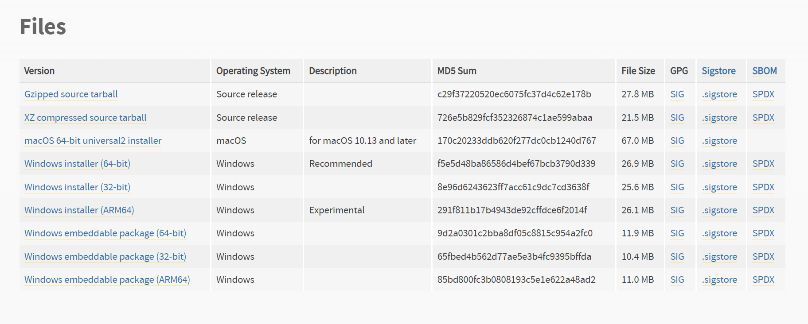
### 3. Add the recommended extension for VSCode by searching the Extension ID in the Extensions tab (ctrl+shift+x)
* Install the Python language support extension (Extension ID: ms-python.python)
### 4. Install the discord.py library
* For Windows install the discord.py library using the following command in the terminal "py -3 -m pip install -U discord.py"
* For Linux  install the discord.py library using the following command in the terminal "pip3 install -U discord.py"
### 5. Make a Discord account if you don't have one and configure it for developing discord applications
1. [This link should take you to a login page where you can login or make a new account](https://discord.com/login)
2. Now go to the settings of your account.
3. Go to the Advanced tab and turn on developer mode 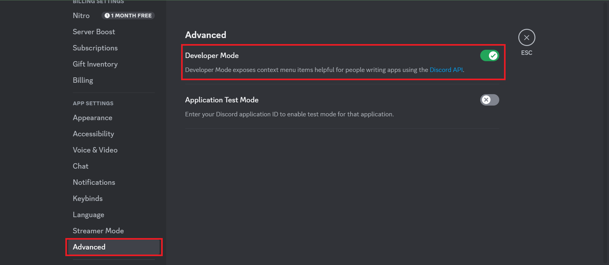
### 6. Make a new application in the Discord developer portal
* Go to the [Discord developer portal](https://discord.com/developers/applications).
* Click the "New Application" button. 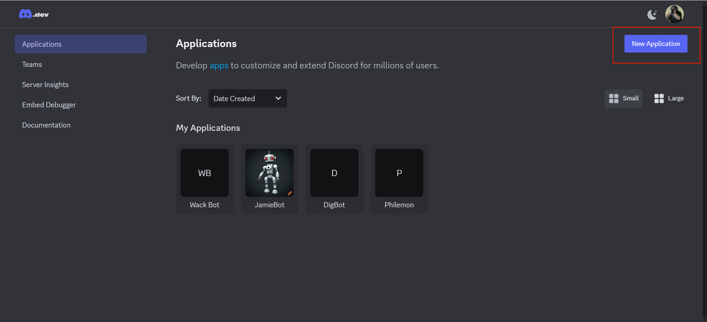
* In the popup type a name for your Discord bot and agree to the Developer TOS and the Developer policy. 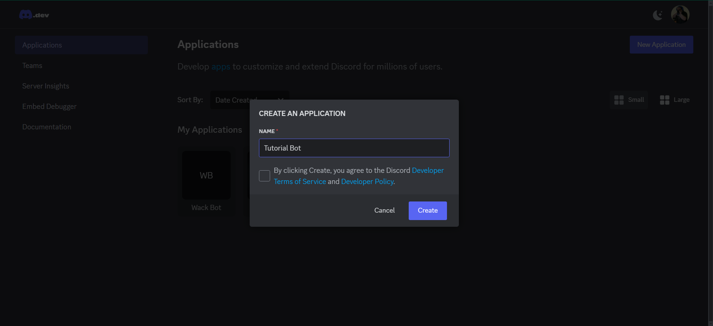
### 7. Create a test Discord server for you to test your bot in.
* Either in the Discord application or on the [Discord website](https://discord.com/channels/@me) click the add a server button. 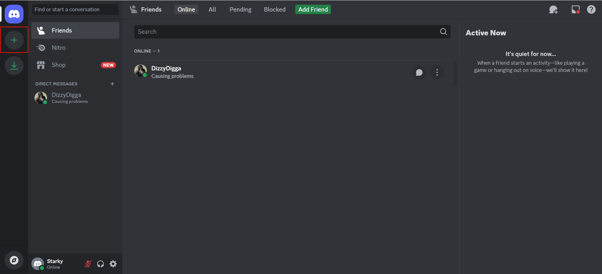
* Click the "Create My Own" button. 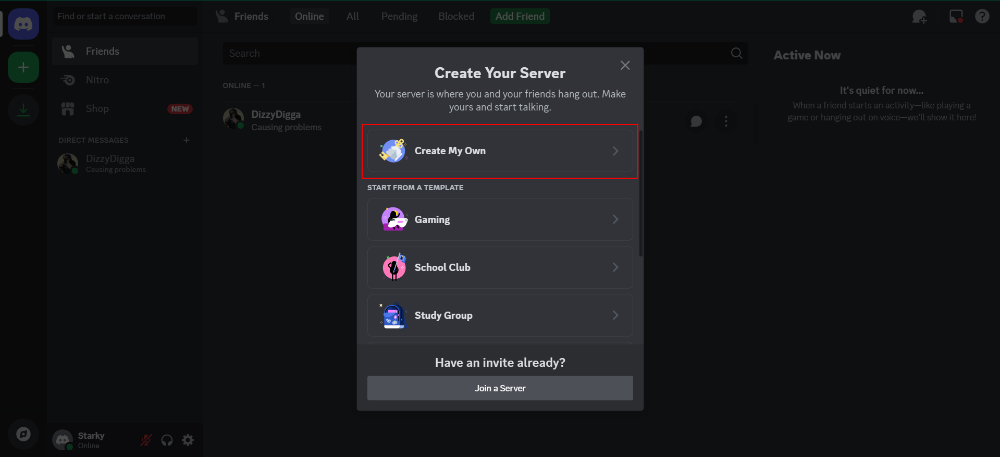
* Click the "For me and my freinds button".
* Name your server and click create. 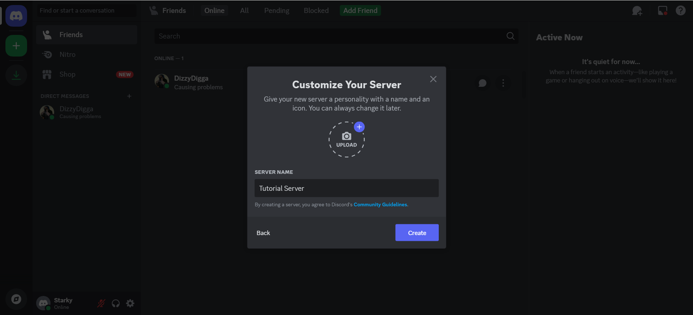
### 8. Invite the bot to the test server you just made.
* Go to your [Discord developer portal](https://discord.com/developers/applications)
* Go to the Bot tab and scroll down to "Priveleged Gatewat Intents" and turn **(((ON)))** message content intent. 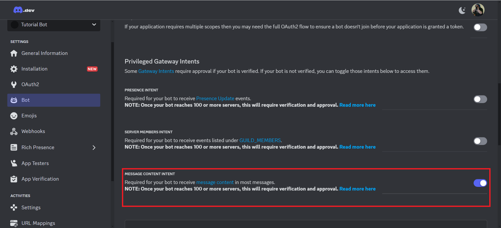
* Go to the OAuth2 tab page for your bot.!(OAuth2 Location)[OAuth2_Loacation.png]
* Set the URI Redirect to "https://discordapp.com/oauth2/authorize?&client_id={yourClientIDhere}&scope=bot" 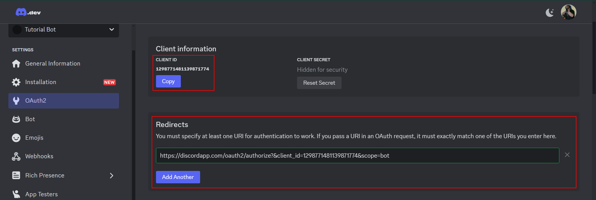
* Check the bot and messages.read boxes under scopes for bot. 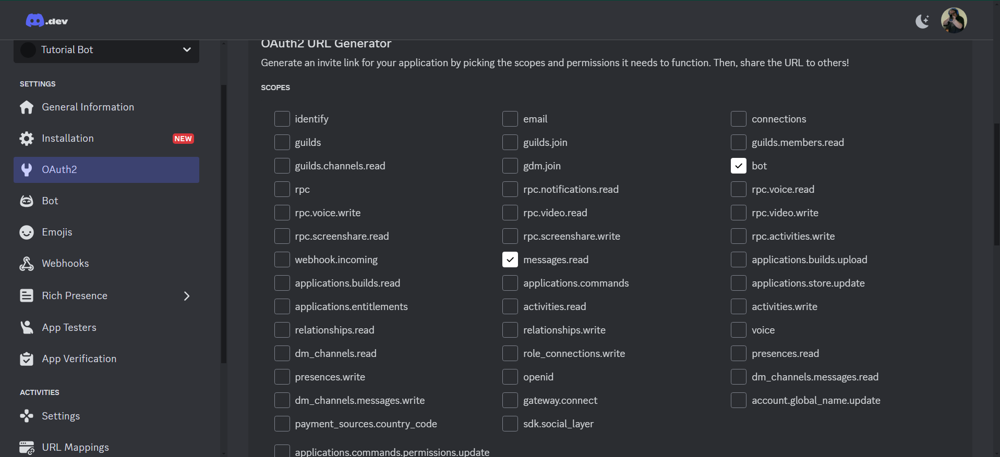
* Select the Redirect URI you just made. 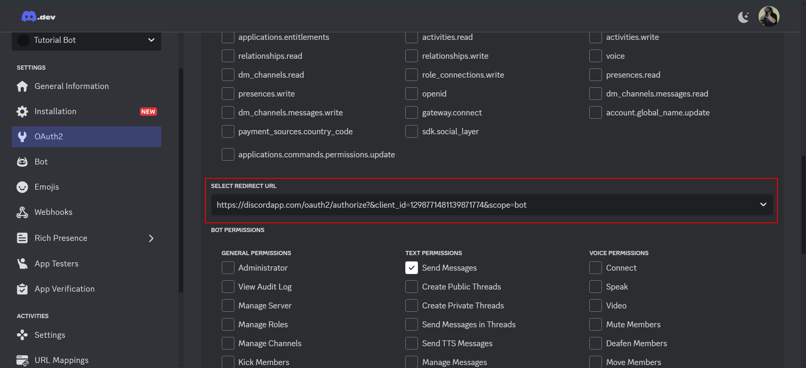
* Check the bot permissions shown in the picture below. 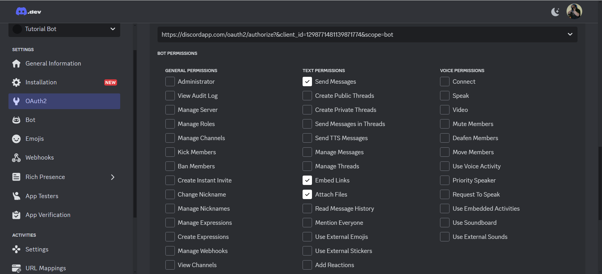
* Copy the generated URL. 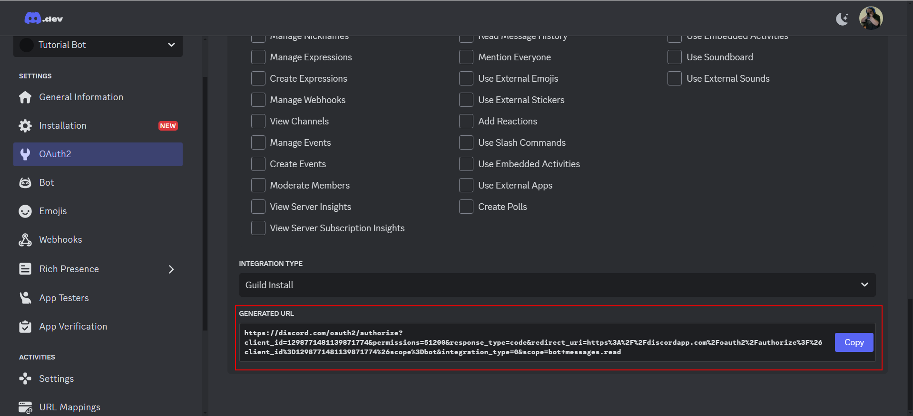
* Copy your new URL into your browser.
* Invite the bot to your test server. 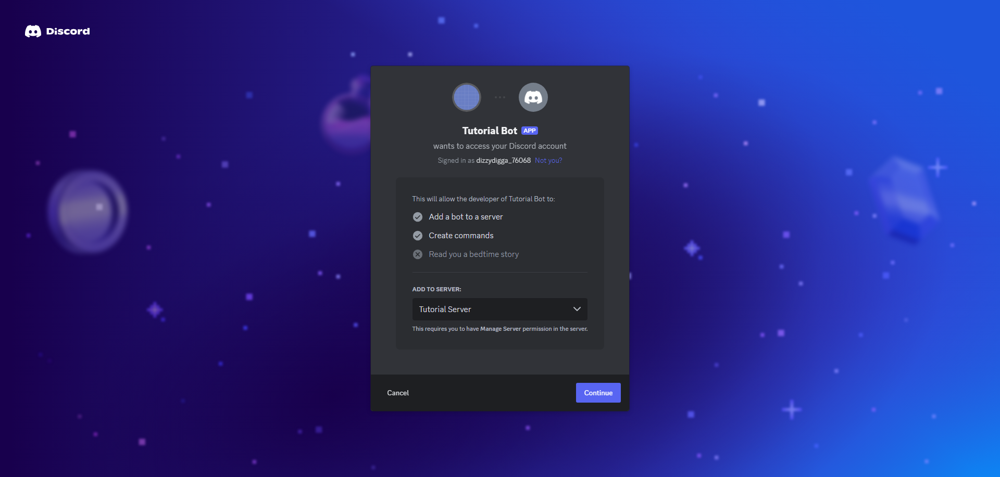
* Approve the permissions for the bot. 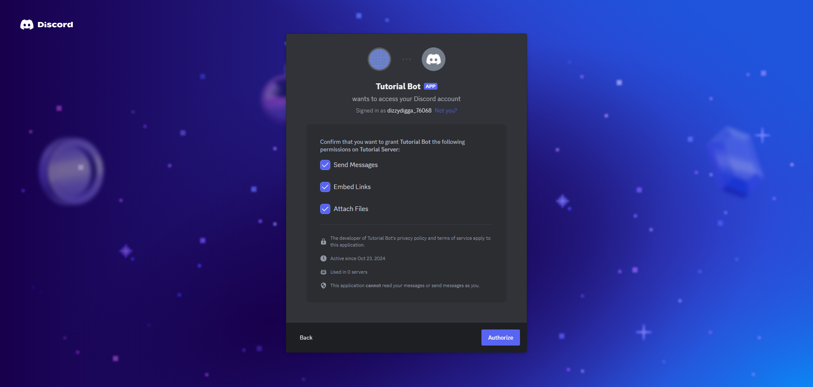
### 9. Create the .py file to start proramming your bot in.
* Open VScode and click "New file..." 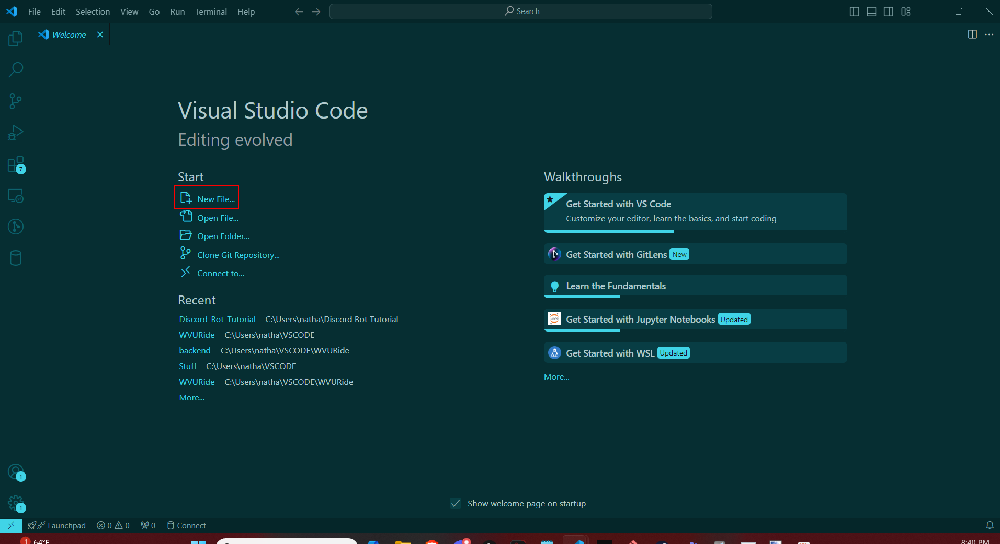
* Name the file "{BotName}.py" with the name you used in step 6 when making the application for the bot.
* You can put the file in whatever folder you want, but I suggest making a new one for your bot.
### 10. Begin by importing your packages, adding special commands, and stubbing out methods.
* Start by importing the required packages like so: 
```python
import discord
import time
import random
from discord.ext import tasks
```

* Set a prefix character of your choice. I will use '!' 
```python
prefix = '!'
```
* Set a variable named interval and make its value 7200
```python
interval = 7200
```
* Set a variable named first_time and make its value 1
```python
first_time = 1
```
* Set the client variable up:
```python
client = discord.Client
```
* Finally declare your class and stub out your messages: 
```python
@tasks.loop()
async def on_interval():


class MyClient(discord.Client):

	async def on_ready(self):


	async def on_message(self, message):
```
### 11. Start writing the on_ready method.
* Inside the on_ready method you will write a startup message. This can be customized however you want but mine looks like the following:
```python
async def on_ready(self):
	print(self.user + " is ready...")
```
### 12. Set up your variables, make sure the bot didn't send the message, and implement the hello command.
* The first steps are to store the message content in an easily accessible variable, store the channel the message was sent in as a easily accessible variable and make sure we did not send the message (this last part is just a safety mechanism and isn't techinically needed since the bot will never send any of its own commands).
```python
# all of this goes in the on_message() function
message_content = message.content.lower()
channel = message.channel
if message.author == self.user:
	return
```
* Now write the introduction command. This one I do not add the prefix to as a preference.
```python
# goes in the on_message() function
if 'hello tutorial bot' in message_content:
	await channel.send("Hello {}".format(message.author.name))
```
### 13. Collect some images from the internet and make a command to send them.
* Collect the images from the internet that you want the bot to send when you use the command we are about to set up. I chose different colors as an example.
* Take the links and put them in an array **outside** of the class.
```python
# this goes outside the Class
links = ["link1", "link2", "link3"]
```
* Write the if statement to check for the command and send a random one of your links.
```python
# this goes in the on_message() function
if (prefix + 'links') in message_content:
	await channel.send(random.choice(links))
```
### 14. Collect some gifs you like and make a command to send them.
* Collect some gifs. These should be from [tenor](https://tenor.com/) (the built in gif renderer) in order to make this step easier.
* Put the links to the gifs in an array **outside** of the class.
```python
# this goes outside the Class
gifs = ["gif1", "gif2", "gif3"]
```
* Write the if statement to check for the command and send a random on of your gifs
```python
# this goes in the on_message() function
if(prefix + 'gifs') in message_content:
	await channel.send(random.choice(links))
```
### 15. Write the "set interval" command.
* Begin by writing the if statement.
```python
# this goes in the on_message() function
if (prefix + 'set interval') in message:
```
* Now we want to edit the global variables (the variables outside the class) called interval and first_time. To do this we will start by writing the following line of code inside the if statement:
```python
# inside the if statement you just wrote
global interval
global first_time
```
* The previous step allows us to access the interval and first_time variables that is global instead of making a new variable inside the if statement. Now we will set the interval to the value sent by the user in the command using the following command and set first_time to 1:
```python
# inside the if statement you just wrote
interval = int(message_content[15:])
first_time = 1
```
* The previous step just takes the last bit of the message (the part after the space between the word interval and the new interval value) and turns it into an int to set the new interval.
* Now we will reset the on_interval command to run with the new interval.
```python
on_interval.change_interval(seconds = interval)
```
### 16. Create the on_interval method.
* The interval method already is set up to run on the interval defined by the interval variable using the
```python
@tasks.loop(seconds = interval)
```
command above the methods header.
* Acquire the channel ID of the channel you want this message to be sent in by right clicking the channel you want it sent in and clicking "Copy Channel ID". 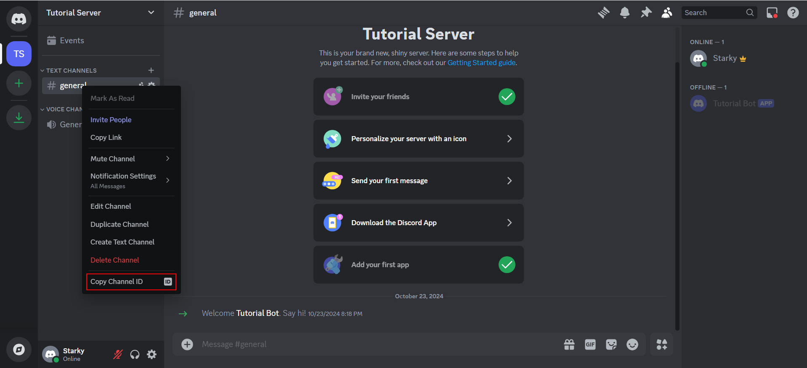
* To make sure this doesn't send as soon as the bot starts write an if statement to prevent it and use the global command to gain access to first_time:
```python
global first_time
if(first_time != 1):
```
* With the channel id write the following lines of code inside the on_interval method:
```python
# inside the if statement in the on_interval() function
channel = client.get_channel({channel id})
await channel.send("Whatever you want this to say")
```
* Set the first_time variable to 2 outside of the for loop so that the message will be sent next time it runs:
```python
first_time = 2
```
### 17. Acquire the token for your bot and set it up so your bot can work.
* Go back to the discord developer portal and go to the page for this bot.
* Go to the Bot tab and click reset token. 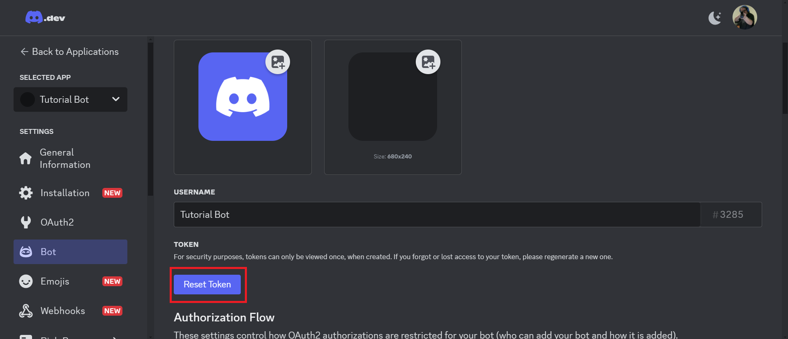
* A pop up will appear and you will click the red button. 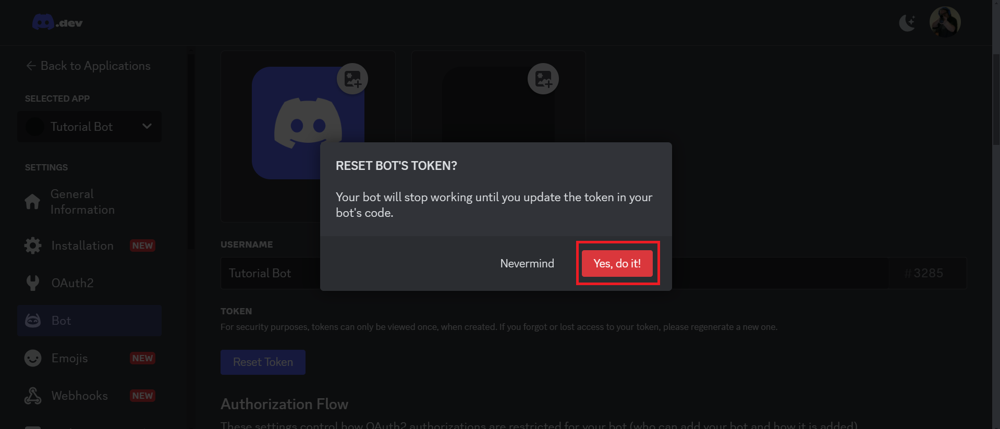
* A new token will be generated. Copy the token to your clipboard.
* In your .py file where you have been programming your bot, add the following code:
```python
intents = discord.Intents.default()
intents.message_content = True
client = MyClient(intents=intents)
bot = discord.bot("Your Token Here")
```
### 18. Run the python program.
* To run your bot's code type "python {bot_file_name}.py" into the terminal.
### 19. Test your bot in your test server.
* Try using the commands you made and see what your new Discord Bot can do!

## Troubleshooting
* If you are running into compile errors please refer to my sample discord bot for the correct white space since python utilizes white space to determine the inside of functions and if statements
* If your bot is not sending or receiving messages please be sure to check step 8 and make sure you correctly set up your permissions and scopes and make sure the message content intent is **on**