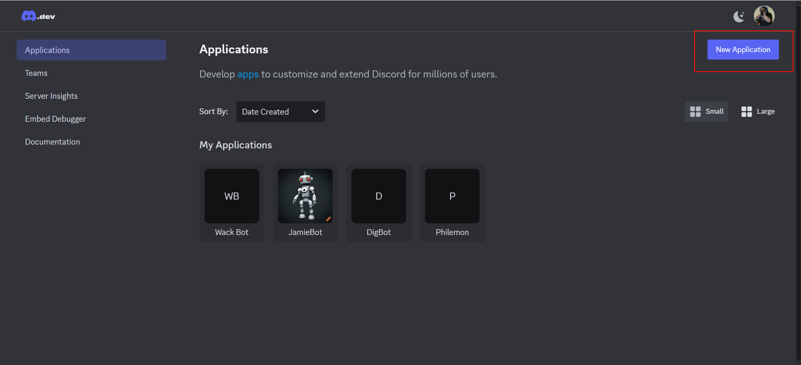
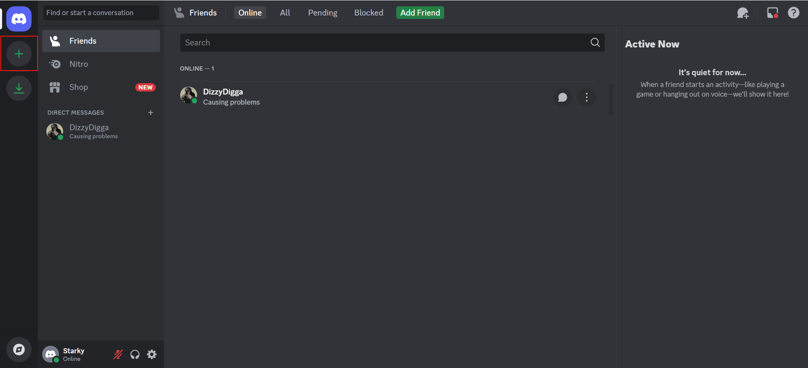
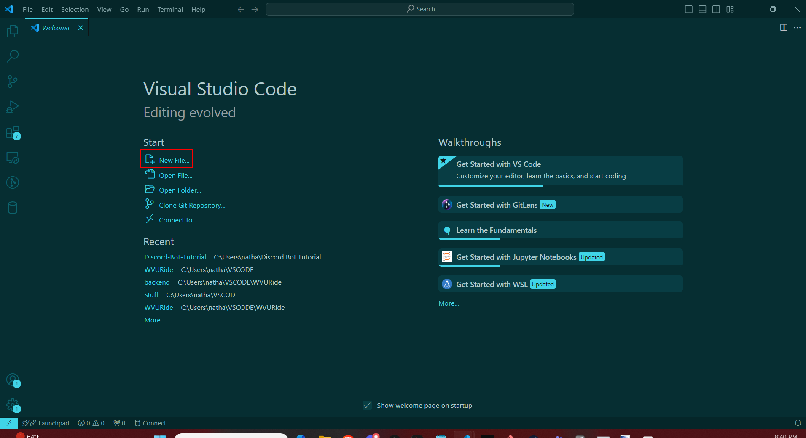

# Discord-Bot-Tutorial
A short tutorial on how to start building Discord Bots that perform simple tasks.

## Materials
To make a Discord bot you will need to have somewhere to create it and Python itself. I also have shared some extensions I used to make things easier. The provided list is what I'm using, but it is possible to use other options.
* [VSCode](https://code.visualstudio.com/)
* The Python language support extension in VSCode (Extension ID: ms-python.python)
* The discord.py package
* [Python version 3.13.0](https://www.python.org/downloads/release/python-3130/)
* A [Discord account](https://discord.com/login?redirect_to=%2Fdevelopers%2Fapplications%2F)

## Instructions
### 1. Download [VSCode](https://code.visualstudio.com/)
* Go to their website [here](https://code.visualstudio.com/) and download the correct version for your system.
* Follow the installation steps in the installation wizard.
### 2. Download [Python version 3.13.0](https://www.python.org/downloads/release/python-3130/)
* Go the the [download page](https://www.python.org/downloads/release/python-3130/) and download the correct version for your system
* 
### 3. Add the recommended extension for VSCode by searching the Extension ID in the Extensions tab (ctrl+shift+x)
* Install the Python language support extension (Extension ID: ms-python.python)
### 4. Install the discord.py library
* For Windows install the discord.py library using the following command in the terminal "py -3 -m pip install -U discord.py"
* For Linux  install the discord.py library using the following command in the terminal "pip3 install -U discord.py"
### 5. Make a Discord account if you don't have one
* [This link should take you to a login page where you can login or make a new account](https://discord.com/login?redirect_to=%2Fdevelopers%2Fapplications%2F)
### 6. Make a new application in the Discord developer portal
* Click the "New Application" button. 
* In the popup type a name for your Discord bot and agree to the Developer TOS and the Developer policy. 
### 7. Create a test Discord server for you to test your bot in.
* Either in the Discord application or on the (Discord website)[https://discord.com/channels/@me] click the add a server button. 
* Click the "Create My Own" button. 
* Click the "For me and my freinds button".
* Name your server and click create. 
### 8. Invite the bot to the test server you just made.
* Go to the OAuth2 tab in your (Discord developer portal)[https://discord.com/developers/applications] page for your bot.!(OAuth2 Location)[OAuth2_Loacation.png]
* Check the bot box under scopes for bot. 
* Check the bot permissions shown in the picture below. 
* Copy the generated URL. 
* Copy your new URL into your browser.
* Invite the bot to your test server. 
* Approve the permissions for the bot. 
### 9. Create the .py file to start proramming your bot in.
* Open VScode and click "New file..." 
* Name the file "{BotName}.py" with the name you used in step 6 when making the application for the bot.
* You can put the file in whatever folder you want, but I suggest making a new one for your bot.
### 10. Begin by importing your packages, adding special commands, and stubbing out methods.
* Start by importing the required packages like so: 
```python
import discord
import time
import random
from discord.ext import tasks
```

* Set a prefix character of your choice. I will use '!' 
```python
prefix = '!'
```
* Set a variable named interval and make its value 7200
```python
interval = 7200
```
* Finally declare your class and stub out your messages: 
```python
class MyClient(discord.Client):

	@tasks.loop()
	async def on_interval():


	async def on_ready(self):


	async def on_message(self, message):
```
### 11. Start writing the on_ready method.
* Inside the on_ready method you will write a startup message. This can be customized however you want but mine looks like the following:
```python
async def on_ready(self):
	print(self.user + " is ready...")
```
### 12. Set up your variables, make sure the bot didn't send the message, and implement the hello command.
* The first steps are to store the message content in an easily accessible variable, store the channel the message was sent in as a easily accessible variable and make sure we did not send the message (this last part is just a safety mechanism and isn't techinically needed since the bot will never send any of its own commands).
```python
message_content = message.content.lower()
channel = message.channel
if message.author == self.user:
	return
```
* Now write the introduction command. This one I do not add the prefix to as a preference.
```python
if 'hello tutorial bot' in message_content:
	await message.send("Hello {}".format(message.author.name))
```
### 13. Collect some images from the internet and make a command to send them.
* Collect the images from the internet that you want to be able to send. I chose different colors as an example.
* Take the links and put them in an array **outside** of the class.
```python
links = [{link1}, {link2}, {link3}]
```
* Write the if statement to check for the command and send a random one of your links.
```python
if (prefix + 'links') in message_content:
	await message.send(random.choice(links))
```
### 14. Collect some gifs you like and make a command to send them.
* Collect some gifs. These should be from tenor (the built in gif renderer) in order to make this step easier.
* Put the links to the gifs in an array **outside** of the class.
```python
gifs = [{gif1}, {gif2}, {gif3}]
```
* Write the if statement to check for the command and send a random on of your gifs
```python
if(prefix + 'gifs') in message_content:
	await message.send(random.choice(links))
```
### 15. Write the "set interval" command.
* Begin by writing the if statement.
```python
if (prefix + 'set interval') in message:
```
* Now we want to edit the global variable (the variable outside the class) called interval. To do this we will start by writing the following line of code inside the if statement:
```python
global interval
```
* The previous step allows us to access the interval variable that is global instead of making a new variable inside the if statement. Now we will set the interval to the value sent by the user in the command using the following command:
```python
interval = int(message_content[15:])
```
* The previous step just takes the last bit of the message (the part after the space between the word interval and the new interval value) and turns it into an int to set the new interval.
### 16. Create the on_interval method.
* The interval method already is set up to run on the interval defined by the interval variable using the
```python
@tasks.loop(interval)
```
command above the methods header.
* Acquire the channel ID of the channel you want this message to be sent in.
* With the channel id write the following lines of code inside the on_interval method:
```python
channel = client.get_channel({channel id})
await channel.send("Whatever you want this to say")
```
### 17. Acquire the token for your bot and set it up so your bot can work.
* Go back to the discord developer portal and go to the page for this bot.
* Go to the Bot tab and click reset token. !(Reset Token button location)[discord_token_location.png]
* A pop up will appear and you will click the red button. !(Yes Do It!)[Yes_Do_It.png]
* A new token will be generated. Copy the token to your clipboard.
* In your .py file where you have been programming your bot, add the following code:
```python
bot = discord.bot("Your Token Here")
```
### 18. Run the python program.
### 19. Test your bot in your test server.
* Try using the commands you made and see what your new Discord Bot can do!