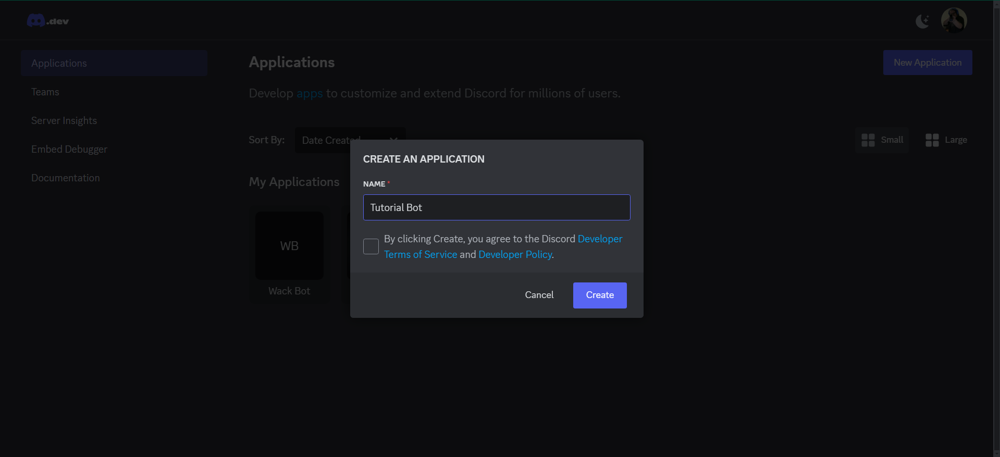
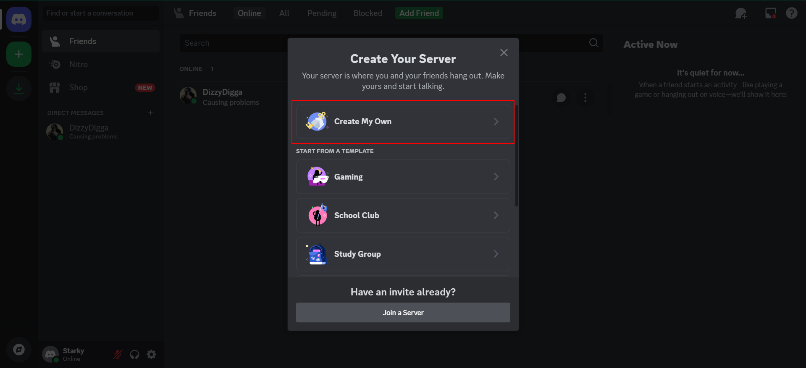
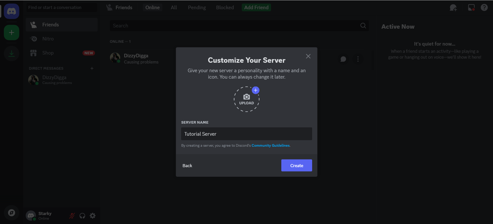
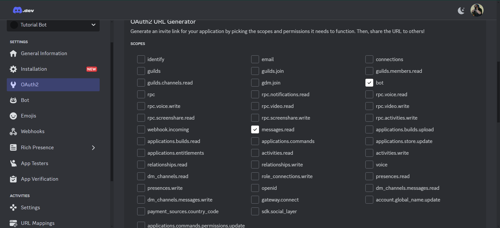
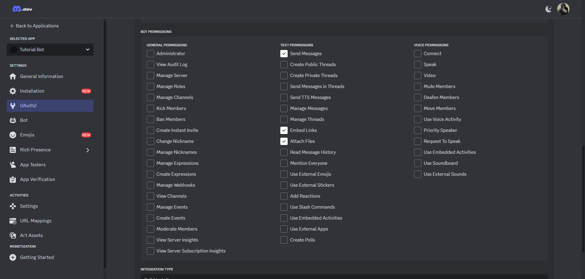
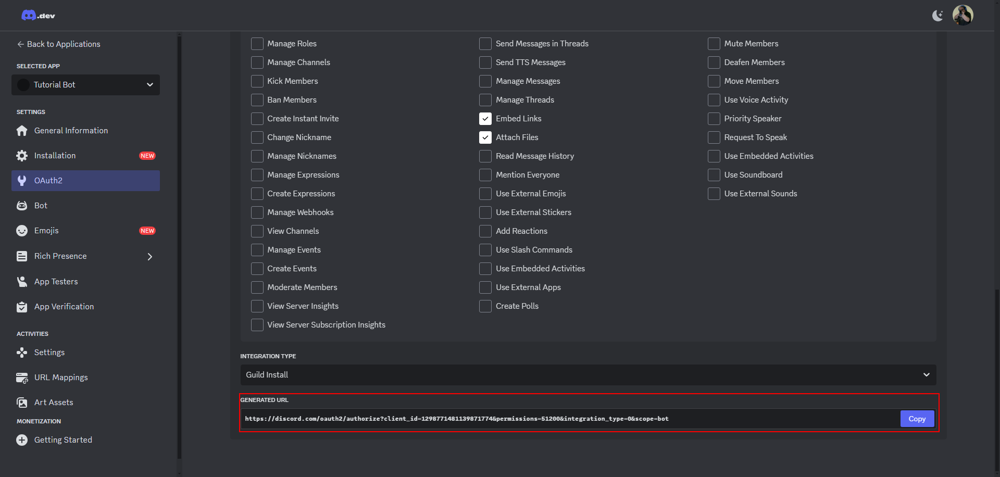
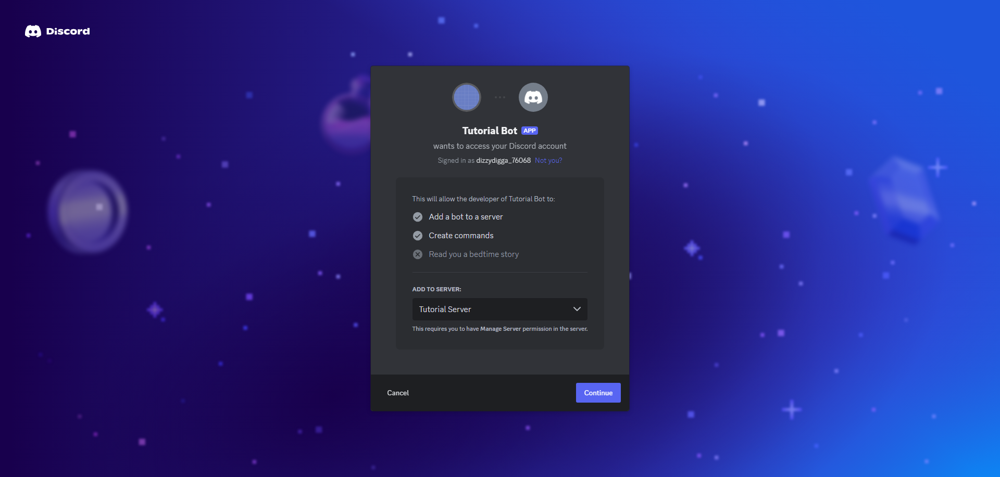
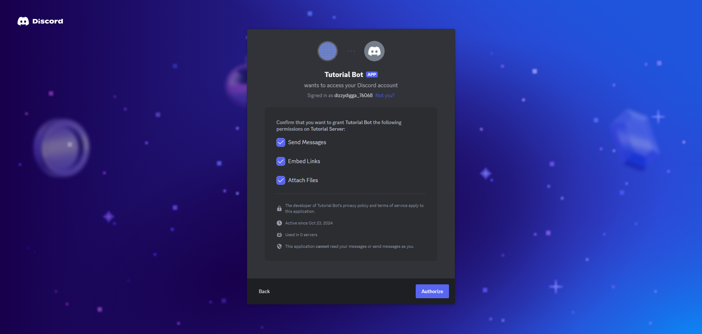

# Discord-Bot-Tutorial
A short tutorial on how to start building Discord Bots that perform simple tasks.

## Materials
To make a Discord bot you will need to have somewhere to create it and Python itself. I also have shared some extensions I used to make things easier. The provided list is what I'm using, but it is possible to use other options.
* [VSCode](https://code.visualstudio.com/)
* The Python language support extension in VSCode (Extension ID: ms-python.python)
* The GitLens VSCode extension in VSCode (Extension ID: eamodio.gitlens)
* [Python version 3.13.0](https://www.python.org/downloads/release/python-3130/)
* A [Discord account](https://discord.com/login?redirect_to=%2Fdevelopers%2Fapplications%2F)

## Instructions
###1. Download [VSCode](https://code.visualstudio.com/)
* Go to their website [here](https://code.visualstudio.com/) and download the correct version for your system.
* Follow the installation steps in the installation wizard.
### 2. Download [Python version 3.13.0](https://www.python.org/downloads/release/python-3130/)
* Go the the [download page](https://www.python.org/downloads/release/python-3130/) and download the correct version for your system
* 
### 3. Add the recommended extensions for VSCode by searching the Extension ID in the Extensions tab (ctrl+shift+x) and install the discord.py library
* Install the Python language support extension (Extension ID: ms-python.python) 
* Install the Gitlens VSCode extension (Extension ID: eamodio.gitlens)
* Install the discord.py library using the following command in the terminal "py -3 -m pip install -U discord.py"
### 4. Make a Discord account if you don't have one
* [This link should take you to a login page where you can login or make a new account](https://discord.com/login?redirect_to=%2Fdevelopers%2Fapplications%2F)
### 5. Make a new application in the Discord developer portal
* Click the "New Application" button. 
* In the popup type a name for your Discord bot and agree to the Developer TOS and the Developer policy. 
### 6. Create a test Discord server for you to test your bot in.
* Either in the Discord application or on the Discord website click the add a server button. 
* Click the "Create My Own" button. 
* Click the "For me and my freinds button".
* Name your server and click create. 
### 7. Invite the bot to the test server you just made.
* Go to the OAuth2 tab in your Discord developer portal page for your bot.
* Check the bot box under scopes for bot. 
* Check the bot permissions shown in the picture below. 
* Copy the generated URL. 
* Copy your new URL into your browser.
* Invite the bot to your test server. 
* Approve the permissions for the bot. 
### 8. Create the .py file to start proramming your bot in.
* Open VScode and click "New file..." 
* Name the file "{BotName}.py" with whatever name you want.
* You can put the file in whatever folder you want, but I suggest making a new one for your bot.
### 9. 

