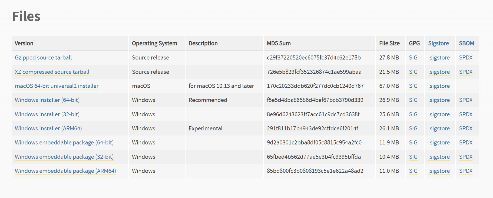

# Discord-Bot-Tutorial
A short tutorial on how to start building Discord Bots that perform simple tasks.

## Materials
To make a Discord bot you will need to have somewhere to create it and Python itself. I also have shared some extensions I used to make things easier. The provided list is what I'm using, but it is possible to use other options.
* [VSCode](https://code.visualstudio.com/)
* The Python language support extension in VSCode (Extension ID: ms-python.python)
* The GitLens VSCode extension in VSCode (Extension ID: eamodio.gitlens)
* [Python version 3.13.0](https://www.python.org/downloads/release/python-3130/)
* A [Discord account](https://discord.com/login?redirect_to=%2Fdevelopers%2Fapplications%2F)

## Instructions
1. Download [VSCode](https://code.visualstudio.com/)
	* Go to their website [here](https://code.visualstudio.com/) and download the correct version for your system.
	* Follow the installation steps in the installation wizard.
2. Download [Python version 3.13.0](https://www.python.org/downloads/release/python-3130/)
	* Go the the [download page](https://www.python.org/downloads/release/python-3130/) and download the correct version for your system
	* 

